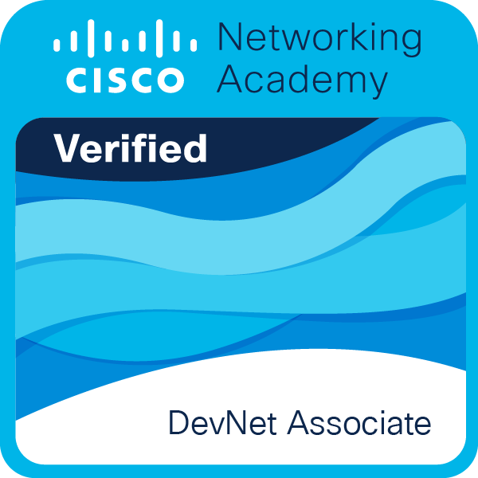

<h1 align="center">Hi 👋, I'm Okello</h1>
<h3 align="center">A passionate developer crafting beautiful and functional software</h3>

  

---

### 🚀 Core Expertise
- **Network Automation & DevOps:** Cisco DevNet Associate, API Management (REST/Webhooks), Docker & Containers, CI/CD Pipelines
- **Security Engineering:** Threat Detection, Risk Assessment, Encryption, Network Defense (Cisco Certified)
- **Cloud Architecture:** AWS Containers, Fargate Deployment, Scalable Infrastructure Design
- **Programming:** Python (Essentials Certified), JavaScript, React, Node.js

### 👨‍💻 About Me

- 🌱 I’m currently diving deeper into **Advanced Software Engineering practices**
- 💬 Ask me about **Frontend architecture, Backend APIs, and system design**
- 📫 How to reach me: **[admin@okellodev.us.kg](mailto:admin@okellodev.us.kg)**
- ⚡ Fun fact: I enjoy **"vibe coding"** in my free time—getting into a creative flow state to build passion projects, experiment with fresh ideas, and keep the art of software development fun!

---

### 🛠 Languages and Tools

  
  
  
  
  
  
  
  
  
  
  

---

### 🎓 Certifications & Achievements
#### 🏆 [View all verified credentials on Credly](https://www.credly.com/users/benedictus-owambo)

*(A continuous journey of learning and improvement)*

- 🏆 **[AWS: Introduction to Containers](./certs/aws-cert.pdf)**
- 🏆 **[AWS Fargate - Overview](./certs/aws-fargate.pdf)**
- 🏆 **[Cisco DevNet Associate](./certs/devnet-associate.pdf)** 
- 🏆 **[HTML Essentials](./certs/html-essentials.pdf)**
- 🏆 **[Introduction to Cybersecurity (JKUAT)](./certs/cybersecurity-jkuat.pdf)**
- 🏆 **[Introduction to Cybersecurity (ALTI)](./certs/intro-to-cybersecurity.pdf)**
- 🏆 **[Python Essentials 1](./certs/python-essentials-1.pdf)**

---

---

### 🚀 Public Projects & Collaborations

Here are a few projects I am publicly sharing and collaborating on:

- 🌟 **[Stretch Therapy](https://stretchtherapykenya.site)**: A comprehensive stretch therapy web project.
- 🌟 **tra-koyeb**: A deployment environment repository containing configurations and services.
- 🌟 **Guerison**: A frontend/expo project setup with its core environment configurations.

### 📊 GitHub Stats

  
  

---

### 📫 Connect with me

  
  
  
  

### ☕ Support my work

  

